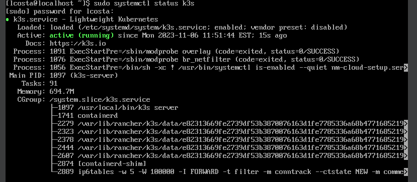
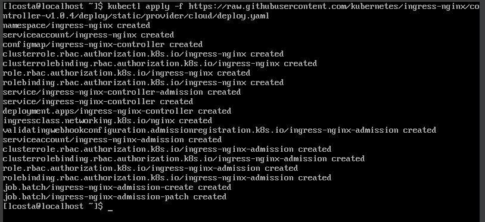
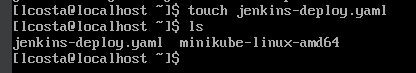
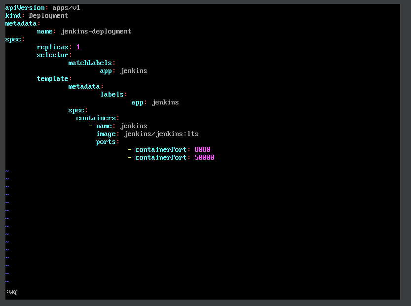
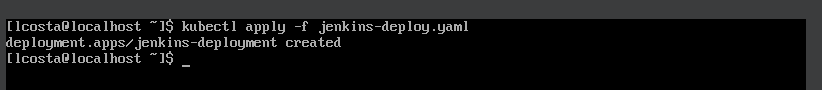
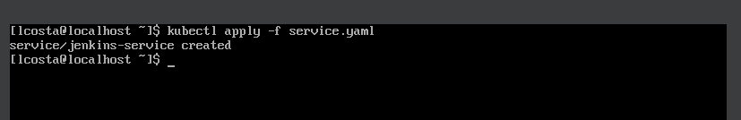
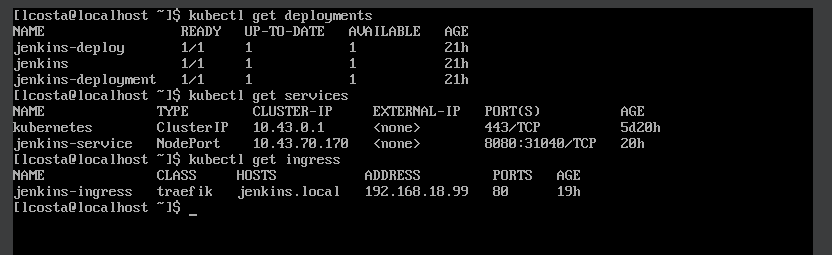

## Desafio 02 - Trilha DevSecOps na CompassUOL - Sprint 3


## Desafio anterior:

[Instalação do K3s](https://github.com/LaraCosta66/compass-kubernetes-d01)

# Nesse Desafio vou criar um deployment do **Jenkins** no **Kubernetes** e configurar o **Ingress**

### Pré-requisitos:

- [K3s](https://docs.k3s.io/installation)
- [Docker](https://docs.docker.com/engine/install/)

## Configurar o Ingress

1. Verifique se o **K3s** está rodando:

```
sudo systemctl status k3s
```



2. Configurar o **_Ingress Controller_**:

- Nesse caso vou usar o **Nginx Ingress Controller**.
- Use esse comando para instalar o controlador do **Ingress** no **Cluster**:

```
kubectl apply -f https://raw.githubusercontent.com/kubernetes/ingress-nginx/controller-v1.0.4/deploy/static/provider/cloud/deploy.yaml
```



## Jenkins

1. Crie um arquivo **YAML**, para fazer a implementação do **Jenkins**

- Use o comando, para criar o arquivo:

```
touch jenkins-deploy.yaml
```

- e **ls**, para verificar se foi criado



2. Configurar o arquivo **jenkins-deploy.yaml**

- Para editar o arquivo, vou utilizar o editor **vim**, caso não o tenha instalado, é só usar o seguinte comando **_yum install vim_**

```
sudo vim jenkins-deploy.yaml
```

- Coloque as seguintes informações nesse arquivo:

```
apiVersion: apps/v1
kind: Deployment
metadata:
  name: jenkins-deployment
spec:
  replicas: 1
  selector:
    matchLabels:
      app: jenkins
  template:
    metadata:
      labels:
        app: jenkins
    spec:
      containers:
      - name: jenkins
        image: jenkins/jenkins:lts
        ports:
        - containerPort: 8080
        - containerPort: 50000
```

- Salve o arquivo **_Esc :wq_**



3. Depois de salvar o arquivo, aplique-o ao cluster **K3s**:

- Use o comando:

```
kubectl apply -f seu-arquivo-de-implantacao.yaml
```



### Service para o **Jenkins**

- Crie um arquivo **_YAML_** para o serviço que irá expor o **Jenkins**:

```
touch service.yaml
```

- Em seguida, edite esse arquivo com as seguintes informações:

```
sudo vim service.yaml
```

```
apiVersion: v1
kind: Service
metadata:
  name: jenkins-service
spec:
  selector:
    app: jenkins
  ports:
    - protocol: TCP
      port: 8080
      targetPort: 8080
  type: NodePort
```

### Depois de salvar o arquivo, aplique-o ao cluster **K3s**:

```
kubectl apply -f seu-arquivo-service.yaml
```



## Configurar o **Ingress** para **Jenkins**

1. Crie um arquivo para configurar o **ingress**

```
touch jenkins-ingress.yaml
```

- Dentro desse arquivo, coloque as seguintes informações:

```
apiVersion: networking.k8s.io/v1
kind: Ingress
metadata:
  name: jenkins-ingress
spec:
  rules:
  - host: jenkins.example.com  # Substitua pelo seu domínio ou IP desejado
    http:
      paths:
      - path: /
        pathType: Prefix
        backend:
          service:
            name: jenkins
            port:
              number: 80
```

- **Depois de salvar o arquivo, aplique-o:**

```
kubectl apply -f jenkins-ingress.yaml
```

## Para verificar se a implantação do Jenkins e do Ingress foi bem-sucedida em seu cluster K3s, você pode realizar algumas etapas de verificação:

### Verifique o Deployment:

```
kubectl get deployment
```

### Verifique o Service:

```
kubectl get services
```

### Verifique o Ingress:

```
kubectl get ingress
```


